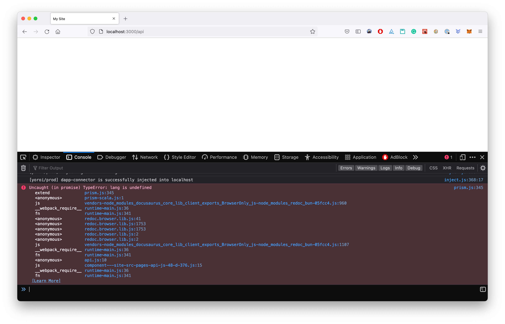

## ☕️ Reproduction

To reproduce the issue, first install the dependencies:

```
$ yarn
```

Then start the website locally:

```
$ yarn start
```

Visit the [example API page](http://localhost:3000/api) and see the page not loading and the errors in the terminal:



### To see the page withlout the error

Remove `java` as syntax highlighting from the **Docusaurus config**:

```js
  prism: {
    theme: lightCodeTheme,
    darkTheme: darkCodeTheme,
    additionalLanguages: ["kotlin"],
  },
```

and visit the [example API page](http://localhost:3000/api) again to see it loading its contents correctly.
